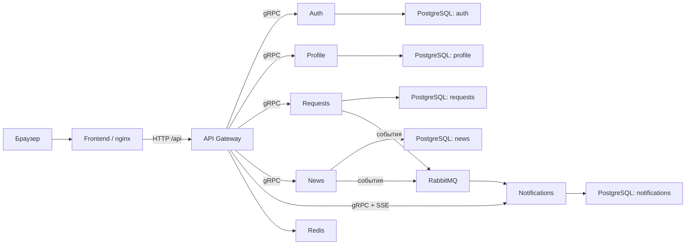

# ЖЭУ Онлайн

Система управления многоквартирным домом: профиль жителя, новости, заявки на обслуживание, уведомления и панель управляющей компании.

## Запуск

Понадобятся Docker и Docker Compose. Из корня проекта выполните:

```bash
make up
```

То же самое без Make:

```bash
docker compose up --build -d --wait
```

В `go.mod` сервисов используется директива `replace`, которая подключает локальный модуль контрактов:

```go
replace github.com/zimnyles/UFANET-2026-housing-management-system/contracts => ../contracts
```

Поэтому Docker-образы необходимо собирать из корня проекта, как указано в `docker-compose.yml`.

После запуска:

- приложение — [http://zhkh.localhost:3000](http://zhkh.localhost:3000);
- API Gateway — [http://localhost:8080/health](http://localhost:8080/health);
- RabbitMQ UI — [http://localhost:15672](http://localhost:15672), логин и пароль `guest`.

Полезные команды:

```bash
make logs          # логи всех контейнеров
make ps            # состояние контейнеров
make down          # остановка
make down-volumes  # остановка и удаление данных PostgreSQL
```

Другой порт frontend можно задать так:

```bash
FRONTEND_PORT=3001 make up
```

## Как работает система

Frontend отправляет HTTP-запросы `/api/*` через nginx в API Gateway. Gateway проверяет JWT, роли, лимиты запросов и вызывает микросервисы по gRPC. Каждый сервис хранит свои данные в отдельной базе PostgreSQL.



## Связи сервисов

| Компонент | Назначение | Связи |
|---|---|---|
| `api-gateway` | Единая HTTP-точка входа, JWT, роли и rate limit | gRPC ко всем микросервисам, Redis для служебных данных |
| `auth-service` | Регистрация, вход и выпуск JWT | собственная БД `auth` |
| `profile-service` | Профили, дома и управляющие компании | собственная БД `profile` |
| `requests-service` | Заявки, статусы и комментарии | БД `requests`, публикует события в RabbitMQ |
| `news-service` | Новости домов | БД `news`, публикует события в RabbitMQ |
| `notification-service` | Устройства, история и поток уведомлений | БД `notifications`, получает события RabbitMQ, отдаёт поток через gRPC |
| `frontend` | Пользовательский интерфейс | nginx проксирует `/api/*` в API Gateway |

Когда создаётся новость или меняется заявка, соответствующий сервис публикует событие в RabbitMQ. Notification Service получает событие, сохраняет уведомление и передаёт его в браузер через SSE-эндпоинт Gateway.
